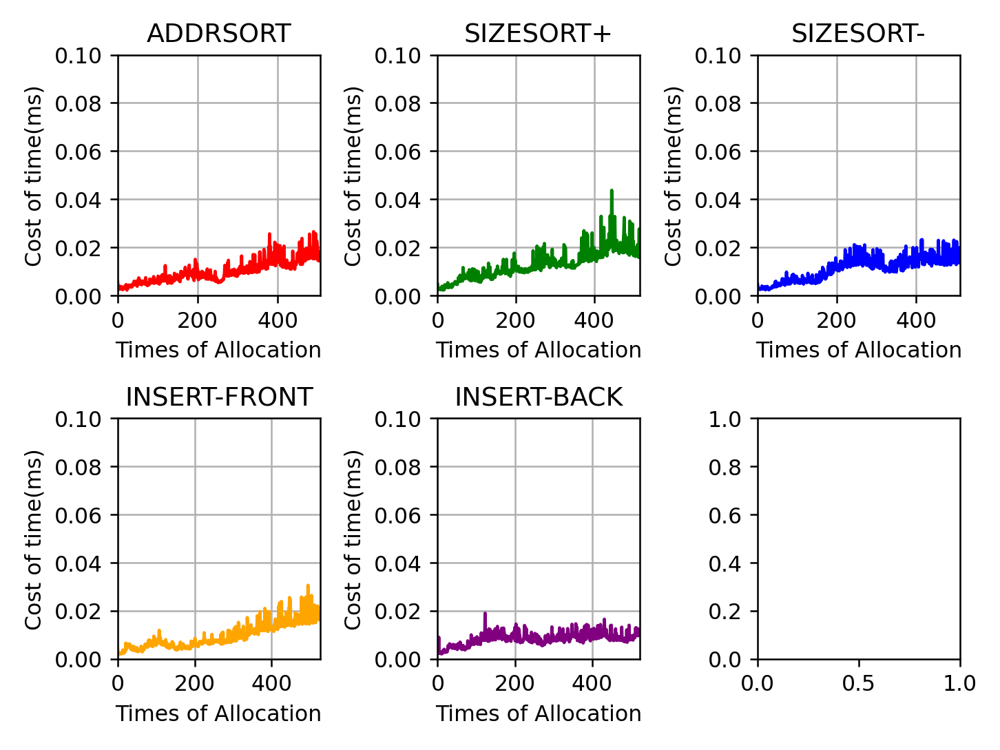
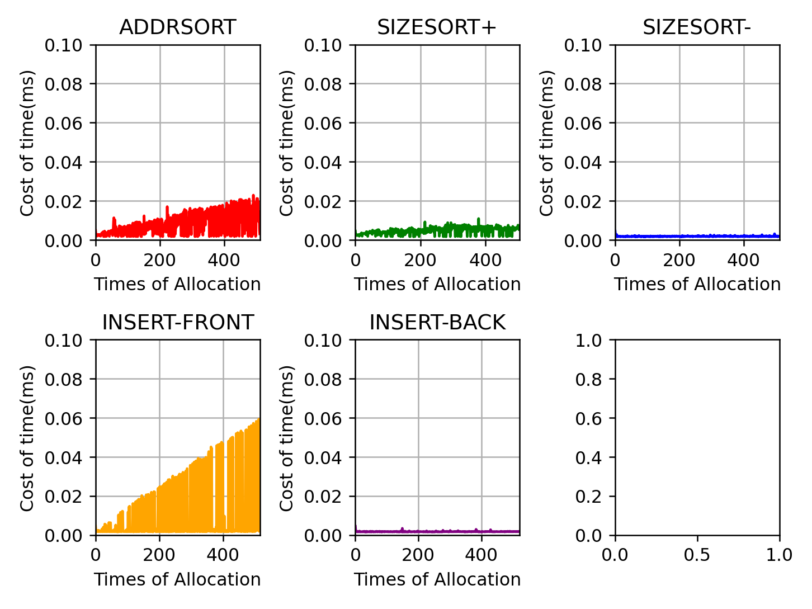
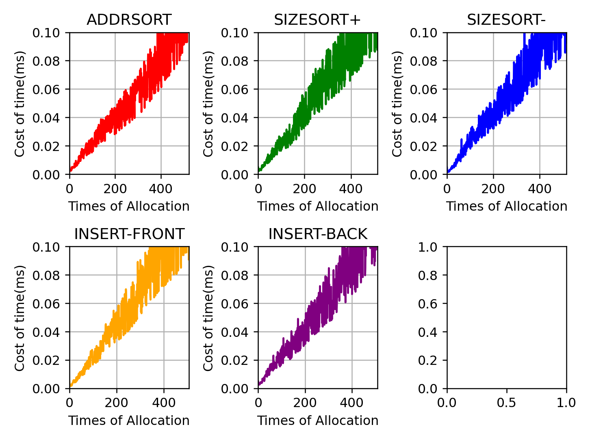

## Question 1

* 首先运行`flag -n 10 -H 0 -p BEST -s 0`来产生一些随机分配和释放的指令。你能预测到`malloc()/free()`会返回什么吗？
	*  如运行结果所示。
* 你可以在每次请求后猜出空闲列表的状态吗？
	*  如运行结果所示。
* 随着时间的推移，你对空闲列表有什么发现？
	*  随着分配和释放内存的次数增加，在没有给定`合并`选项的前提下，在空闲列表中会产生越来越多的小的内存空间，这些内存空间因为太小以致于几乎无法被分配出去，产生较为严重的`外部碎片`问题。

#### 运行结果
```sh
seed 0
size 100                       # 堆的大小
baseAddr 1000                  # 堆开始的首地址
headerSize 0                   # 头节点的大小
alignment -1                   # 是否对齐(-1 => 不对齐)
policy BEST                    # 内存分配的策略：最优策略
listOrder ADDRSORT             # 空闲列表按照地址排序
coalesce False                 # 是否合并
numOps 10                      # 生成的分配或释放操作的数量
range 10                       # 分配内存大小的取值范围[1, 10]
percentAlloc 50                # 用于产生分配内存操作数量的比例
allocList
compute False

ptr[0] = Alloc(3) returned 1000 (searched 1 elements)
Free List [Size 1]: [addr: 1003, size: 97]

Free(ptr[0])
returned 0
Free List [Size 2]: [addr: 1000, size: 3] [addr: 1003, size: 97]

ptr[1] = Alloc(5) returned 1003 (searched 2 elements)
Free List [Size 2]: [addr: 1000, size: 3] [addr: 1008, size: 92]

Free(ptr[1])
returned 0
Free List [Size 3]: [addr: 1000, size: 3] [addr: 1003, size: 5] [addr: 1008, size: 92]

ptr[2] = Alloc(8) returned 1008 (searched 3 elements)
Free List [Size 3]: [addr: 1000, size: 3] [addr: 1003, size: 5] [addr: 1016, size: 84]

Free(ptr[2])
returned 0
Free List [Size 4]: [addr: 1000, size: 3] [addr: 1003, size: 5] [addr: 1008, size: 8]
                    [addr: 1016, size: 84]

ptr[3] = Alloc(8) returned 1008 (searched 4)
Free List [Size 3]: [addr: 1000, size: 3] [addr: 1003, size: 5] [addr: 1016, size: 84]

Free(ptr[3])
returned 0
Free List [Size 4]: [addr: 1000, size: 3] [addr: 1003, size: 5] [addr: 1008, size: 8]
                    [addr: 1016, size: 84]

ptr[4] = Alloc(2) returned 1000 (searched 4 elements)
Free List [Size 4]: [addr: 1002, size: 1] [addr: 1003, size: 5] [addr: 1008, size: 8]
                    [addr: 1016, size: 84]

ptr[5] = Alloc(7) returned 1008 (searched 4 elements)
Free List [Size 4]: [addr: 1002, size: 1] [addr: 1003, size: 5] [addr: 1015, size: 1]
                    [addr: 1016, size: 84]
```

## Question 2
* 使用==最差匹配策略==搜索空闲列表(`-p WORST`)时，结果有何不同？什么改变了？
	*  从`ptr[3] = Alloc(8)`开始，由于内存分配程序选择的是最差匹配策略，程序跳过了空闲列表中内存大小与请求大小刚好匹配的部分(`[addr: 1008, size: 8]`)，反而寻找大小最大的空闲内存，然后进行分割，即分割出`[addr: 1024, size: 8]`。在经过之后的`free(ptr[3])`操作之后，`[addr:1024, size: 8]`进入空闲列表，这就导致了空闲列表中增加了多余的”碎片“。
	* ***最差匹配不仅会产生过量的碎片，还会导致巨大的开销。***

#### 运行结果
```sh
./malloc.py -n 10 -H 0 -p WORST -s 0
seed 0
size 100
baseAddr 1000
headerSize 0
alignment -1
policy WORST
listOrder ADDRSORT
coalesce False
numOps 10
range 10
percentAlloc 50
allocList
compute False

ptr[0] = Alloc(3) returned 1000 (searched 1 elements)
Free List [Size 1]: [addr: 1003, size: 97]

Free(ptr[0])
returned 0
Free List [Size 2]: [addr: 1000, size: 3] [addr: 1003, size: 97]

ptr[1] = Alloc(5) returned 1003 (searched 2 elements)
Free List [Size 2]: [addr: 1000, size: 3] [addr: 1008, size: 92]

Free(ptr[1])
returned 0
Free List [Size 3]: [addr: 1000, size: 3] [addr: 1003, size: 5] [addr: 1008, size: 92]

ptr[2] = Alloc(8) returned 1008 (searched 3 elements)
Free List [Size 3]: [addr: 1000, size: 3] [addr: 1003, size: 5] [addr: 1016, size: 84]

Free(ptr[2])
returned 0
Free List [Size 4]: [addr: 1000, size: 3] [addr: 1003, size: 5] [addr: 1008, size: 8]
                    [addr: 1016, size: 84]
# 从此处开始发生变化
ptr[3] = Alloc(8) returned 1016 (searched 4 elements)
Free List [Size 4]: [addr: 1000, size: 3] [addr: 1003, size: 5] [addr: 1008, size: 8]
                    [addr: 1024, size: 76]

Free(ptr[3])
returned 0
Free List [Size 5]: [addr: 1000, size: 3] [addr: 1003, size: 5] [addr: 1008, size: 8]
                    [addr: 1016, size: 8] [addr: 1024, size: 76]

ptr[4] = Alloc(2) returned 1024 (searched 5 elements)
Free List [Size 5]: [addr: 1000, size: 3] [addr: 1003, size: 5] [addr: 1008, size: 8]
                    [addr: 1016, size: 8] [addr: 1026, size: 74]

ptr[5] = Alloc(7) returned 1026 (searched 5 elements)
Free List [Size 5]: [addr: 1000, size: 3] [addr: 1003, size: 5] [addr: 1008, size: 8]
                    [addr: 1016, size: 8] [addr: 1033, size: 67]
```

## Question 3
* 如果使用首次匹配(`-p FIRST`)会如何？使用首次匹配时，什么变快了？
	*  内存分配程序在响应内存请求的速度上变快了，即在空闲列表中寻找满足程序请求内存大小的要求上，其效率变高了。

#### 运行结果
```sh
 ./malloc.py -n 10 -H 0 -p FIRST -s 0
seed 0
size 100
baseAddr 1000
headerSize 0
alignment -1
policy FIRST
listOrder ADDRSORT
coalesce False
numOps 10
range 10
percentAlloc 50
allocList
compute False

ptr[0] = Alloc(3) returned 1000 (searched 1 elements)
Free List [Size 1]: [addr: 1003, size: 97]

Free(ptr[0])
returned 0
Free List [Size 1]: [addr: 1000, size: 3] [addr: 1003, size: 97]

ptr[1] = Alloc(5) returned 1003 (searched 2 elements)
Free List [Size 2]: [addr: 1000, size: 3] [addr: 1008, size: 92]

Free(ptr[1])
returned 0
Free List [Size 3]: [addr: 1000, size: 3] [addr: 1003, size: 5] [addr: 1008, size: 92]

ptr[2] = Alloc(8) returned 1008 (searched 3 elements)
Free List [Size 3]: [addr: 1000, size: 3] [addr: 1003, size: 5] [addr: 1016, size: 84]

Free(ptr[2])
returned 0
Free List [Size 4]: [addr: 1000, size: 3] [addr: 1003, size: 5] [addr: 1008, size: 8]
					[addr: 1016, size: 84]
# 此处与之前不同，FIRST策略只迭代了三次，而不是遍历整个空闲列表
ptr[3] = Alloc(8) returned 1008 (searhed 3 elements)
Free List [Size 3]: [addr: 1000, size: 3] [addr: 1003, size: 5] [addr: 1016, size: 84]

Free(ptr[3])
returned 0
Free List [Size 4]: [addr: 1000, size: 3] [addr: 1003, size: 5] [addr: 1008, size: 8]
					[addr: 1016, size: 84]
# 此处也与之前不同，FIRST策略只访问了空闲列表的第一个元素
ptr[4] = Alloc(2) returned 1000 (searched 1 elements)
Free List [Size 4]: [addr: 1002, size: 1] [addr: 1003, size: 5] [addr: 1008, size: 8]
					[addr: 1016, size: 84]
# 此处也与之前不同，FIRST策略只访问了空闲列表的第三个元素
ptr[5] = Alloc(7) returned 1008 (searched 3 elements)
Free List [Size 4]: [addr: 1002, size: 1] [addr: 1003, size: 5] [addr: 1015, size: 1]
					[addr: 1016, size: 84]
```

## Question 4

* 对于上述问题，列表在保持有序时，可能会影响某些策略找到空闲位置所需要的时间。使用不同的空闲列表进行排序(`-l ADDRSORT, -l SIZESORT+, -l SIZESORT-`)查看策略和列表排序如何相互影响。
* 以下三张图片分别表示的是5种不同的空闲列表排序策略对采取最优匹配、首次匹配和最差匹配策略寻找空闲空间的性能影响程度，横坐标是分配内存的次数，纵坐标是malloc所耗费的时间。
```sh
Flag: 
seed 0
size 1000         # 堆的大小为1000字节
baseAddr 1000
headerSize 0
alignment -1
policy BEST | FIRST | WORST
listOrder ADDRSORT | SIZESORT+ | SIZESORT- | INSERT-FRONT | INSERT-BACK
coalesce False
numOps 100       # 操作的总数量
range 10
percentAlloc 50
allocList 
compute False
```


							图片1 最优策略分配寻找空闲空间时间受不同排序策略的影响程度


							图片2 首次匹配策略分配寻找空闲空间时间受不同排序策略的影响程度


							图片3 最差匹配策略分配寻找空闲空间时间受不同排序策略的影响程度

先说结论，总的来说，首次匹配策略(`First Policy`)对空闲列表的排序方案非常敏感，而最差匹配策略和最优匹配策略几乎不受到空闲列表排序策略的影响。

首先我们来看看最优匹配策略(图1)，就肉眼来看，这5个曲线几乎有着一模一样的趋势，而且总体趋势是在上升的，但是上升的幅度似乎不大，这其实也可以理解，由于在内存分配程序里没有选择`合并`参数，所以随着分配、释放内存的操作数量不断增加，整个空闲列表会变得越来越大(我指包含元素的个数)，既然最优算法要遍历全部的元素，那么当然总体耗时会随着时间的推移而逐渐增加了。

然后就是关于首次匹配策略所受到的影响(图2)，先看看比较明显的两组图像，ADDRSORT、INSERT-FRONT和SIZESORT+、INSERT-BACK：
1. ADDRSORT：整体趋势呈现”缓坡式“。我想，这其实也很好理解，在源代码中内存的分割方式是这样进行的——取出合适的空闲列表元素`[addr size]`，然后这么做`[addr+header header_size+alloc_size]`就是分配出去的内存，剩下的部分`[addr+header+alloc_size size-header_size-alloc_size]`则留在空闲列表中——可以看到地址部分不断在增加，那么按照ADDRSORT，每当新的内存被释放从而插入到空闲列表时，之前留下的那一部分就会不断地被推往空闲列表的末端，更重要的是，由于一开始是从整个heap开始分割的，所以分割后剩下的部分既是在空闲列表末端的，又是有较大size的，这对于FIRST算法不太友好，因为随着分割的进行，小的”碎片“会不断地留在空闲列表的前端，因此FIRST算法被迫到空闲列表的后面去寻找合适的空闲空间，但是由于进程请求的大小在`[1,10]`区间之内，即使空闲列表的前端有很多小的“碎片”，但这些碎片的一部分也能够满足FIRST算法的需求，这就是为什么图像呈现“缓坡式”而不是“陡坡式”上升趋势。
2. INSERT-FRONT：整体趋势呈现“陡坡式”。比起ADDRSORT，INSERT-FRONT在趋势上和ADDRSORT几乎相同，但区别在于INSERT-FRONT更加“陡”。我个人觉得造成这个差异的最主要因素，就是INSERT-FRONT一定能保证插入到空闲列表前面的都是小的“碎片”，但是ADDRSORT所构造的空闲列表之间也许不全是小的在前面。另外一种可能就是实际上INSERT-FRONT和ADDRSORT在趋势和“梯度”上实际上都是差不多，有可能是随机种子恰好造成了这种差异。
3. SIZESORT-和INSERT-BACK：整体趋势十分稳定，且梯度接近水平。这两个排序算法基本上是所有情况中表现最好的了，这两个算法的特色十分接近，SIZESORT-将最大的空闲内存放在空闲列表的最前面，对于FIRST算法来说，在每一次遍历空闲列表时几乎只要在第一个循环就能找到合适解；而INSERT-BACK这个算法表现得也很好，因为每次分割出去的内存稳定都是小的内存空间，那么回收回来是由于这些小的内存空间都插在了空闲列表的最后，那么就间接地让大的空闲内存被”挤“到了空闲列表的最前端，这对FIRST算法来说也算是一大惊喜了。不过如果考虑到SIZESORT-本身的开销的话，其整体性能似乎不如采取INSERT-BACK算法，然而若是进程请求的内存大小有大有小，那么INSERT-BACK算法的表现似乎也会变差一些。
4. SIZESORT+：整体趋势呈现比较平稳，但是性能比起SIZESORT-和INSERT-BACK要差一些。我似乎发现其实SIZESORT+和ADDRSORT以及INSERT-FRONT应该被归为一组的，因为这三组都是通过直接或间接的方式让空闲列表呈现出前端小，尾端大的状况。但是令我奇怪的是为什么SIZESORT+比ADDRSORT和INSERT-FRONT都要扁平一些，我个人觉得SIZESORT+和ADDRSORT以及INSERT-FRONT之间的最大区别在于，SIZESORT+所构造的空闲列表其大小次序更加稳定，是严格按照空闲空间大小从小到大增长的，而ADDRSORT以及INSERT-FRONT虽然能保证空闲列表前端集中了较小的空闲空间，但是空闲空间之间的相对大小是混乱的——前面的可以比当前的大，后面的也可以比当前的大，除了”波浪式“的相对大小次序，也存在”梯度式“的大小次序——这就是为什么SIZESORT+比较扁平的原因，因为SIZESORT+稳定，而ADDRSORT和INSERT-FRONT不稳定，这也就是为什么此二者呈现出”坡式"，这不就是因为曲线在不断地剧烈上下波动嘛！

最后再看一下最差匹配策略(图3)，最差匹配策略也算是“名副其实”了，WORST策略对于所有的空闲列表排序算法表现都很差，而且趋势也基本一致，可谓是一致地差！我个人认为，WORST策略性能如此低的原因，核心在于两点：
1. WORST策略的最优、平均和最差时间复杂度都是N(只看malloc.py)，但是你可能会说，最优策略不也是一样吗！所以这才是第二点意义之所在；
2. WORST策略每一次都会寻找最大的空闲空间进行分割，这一定会导致最终的空闲列表远远要比BEST策略多，BEST会找到最接近请求大小的，所以在回收回来时，空闲列表大小可以保持不变，FIRST算法虽然也可能会和WORST差不大，但是FIRST因为算法的优势，其平均时间复杂度要比WORST低一些，而空闲列表的不断扩张会导致每一分配内存时所耗费的时间逐级增加。

最后，关于实验中的一些存在的问题：
1. 耗时部分没有计算“释放”内存空间然后对空闲列表进行排序的开销；
2. 进程请求的空间过小`[1, 10]`，可能对某些内存分配算法不利；
3. 以上图片仅仅是测试一遍的结果，还有待多次测试；
4. More....